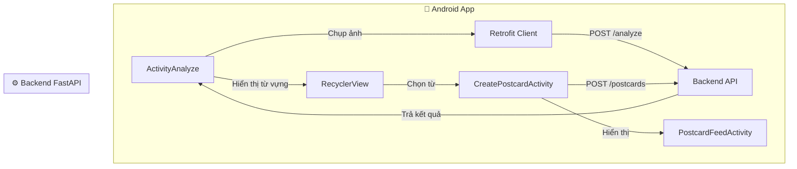

<div align="center">
  
# 📸 SnapVocab - Android App

[](https://kotlinlang.org/)
[](https://developer.android.com/)
[](https://square.github.io/retrofit/)
[](https://github.com/google/gson)
[](https://square.github.io/okhttp/)
[](https://kotlinlang.org/docs/coroutines-overview.html)
[](https://github.com/bumptech/glide)

**Ứng dụng học từ vựng tiếng Anh qua ảnh chụp – Dành cho Android**

</div>

---

## 📖 Giới thiệu

SnapVocab là ứng dụng **chụp ảnh – học từ vựng** dành cho nền tảng Android. Người dùng chụp ảnh một vật thể, ứng dụng sẽ gửi lên backend, nhận diện vật thể và trả về các từ vựng tiếng Anh kèm nghĩa, phát âm, ví dụ. Người dùng có thể lưu từ vựng vào danh sách cá nhân hoặc tạo **postcard** để chia sẻ với bạn bè.

Ứng dụng được xây dựng bằng **Kotlin**, sử dụng **Retrofit** để giao tiếp với backend FastAPI và tích hợp **Camera** để chụp ảnh trực tiếp.

---

## ✨ Tính năng chính

- 📷 **Chụp ảnh** trực tiếp hoặc chọn ảnh từ thư viện.
- 🔍 **Phân tích ảnh** qua backend (YOLO + Gemini).
- 📚 **Hiển thị từ vựng** kèm nghĩa, phát âm, ví dụ.
- 💾 **Lưu từ vựng** vào danh sách cá nhân.
- 🖼️ **Tạo postcard** với ảnh đã chọn và gửi đến bạn bè.
- 👥 **Xem feed postcard** từ bạn bè và các postcard đã gửi/nhận.
- ❤️ **Tương tác** like, comment trên postcard.
- 👤 **Quản lý hồ sơ** và danh sách bạn bè.

---

## 🛠️ Công nghệ sử dụng

| Công nghệ | Vai trò |
|-----------|---------|
| [Kotlin](https://kotlinlang.org/) | Ngôn ngữ lập trình chính |
| [Android SDK 24+](https://developer.android.com/) | Hệ điều hành nền tảng |
| [Retrofit 2](https://square.github.io/retrofit/) | HTTP client gọi API |
| [OkHttp 3](https://square.github.io/okhttp/) | Xử lý request/response, logging |
| [Gson](https://github.com/google/gson) | Serialize/deserialize JSON |
| [Glide](https://github.com/bumptech/glide) | Tải và hiển thị ảnh |
| [Coroutines](https://kotlinlang.org/docs/coroutines-overview.html) | Lập trình bất đồng bộ |
| [ViewModel / LiveData](https://developer.android.com/topic/libraries/architecture/viewmodel) | Quản lý UI state (tuỳ chọn) |
| [Material Design](https://m3.material.io/) | Giao diện người dùng hiện đại |
| [CameraX](https://developer.android.com/training/camerax) (nếu có) | Chụp ảnh trực tiếp |

---

## 🏗️ Kiến trúc tổng quan


---

**📦 Cấu trúc thư mục**
```bash
app/src/main/java/com/snapvocab/app/
├── data/
│   ├── api/
│   │   ├── ApiService.kt         # Định nghĩa Retrofit API
│   │   └── RetrofitClient.kt     # Singleton Retrofit
│   ├── model/
│   │   ├── AnalyzeResponse.kt    # Response từ /analyze
│   │   ├── CreatePostcardData.kt
│   │   ├── Postcard.kt
│   │   └── ...
│   └── repository/               # (Tuỳ chọn)
├── ui/
│   ├── home/
│   │   ├── ActivityAnalyze.kt    # Màn hình chính chụp ảnh
│   │   ├── WordAdapter.kt        # Adapter hiển thị từ vựng
│   │   └── ...
│   ├── postcard/
│   │   ├── CreatePostcardActivity.kt
│   │   ├── PostcardFeedActivity.kt
│   │   └── PostcardFeedAdapter.kt
│   ├── vocabulary/
│   │   ├── VocabularyActivity.kt
│   │   └── VocabularyAdapter.kt
│   └── friends/
├── utils/
│   ├── FileUtils.kt
│   └── ...
└── SnapVocabApp.kt               # Application class
```
---

**🚀 Hướng dẫn build và chạy**
**1. Yêu cầu hệ thống**
- Android Studio Ladybug | 2024.2.1+
- JDK 17+
- Android SDK API 24+ (Android 7.0 trở lên)
- Kết nối Internet để gọi API backend

**2. Clone repository**
```bash
git clone https://github.com/NinhAnhTu/SnapVocab-Frontend-Kotlin.git
cd SnapVocab-Frontend-Kotlin
```
**3. Mở bằng Android Studio**
- Chọn Open an Existing Project → chọn thư mục SnapVocab-Android.
- Đợi Gradle sync hoàn tất.

**4. Cấu hình URL backend**
Mở file app/src/main/java/com/snapvocab/app/data/api/RetrofitClient.kt và sửa BASE_URL:
```kotlin
private const val BASE_URL = "http://192.168.1.100:8000/"   // IP máy chạy backend
```
Lưu ý: Nếu dùng emulator, dùng http://10.0.2.2:8000/ (localhost của máy host). Nếu dùng thiết bị thật, dùng địa chỉ IP cục bộ của máy chạy backend.

**5. Chạy ứng dụng**
- Kết nối thiết bị Android (USB debugging) hoặc dùng emulator.
- Nhấn Run (▶️) trên Android Studio.

---

## 📲 Luồng nghiệp vụ chính
**1. Chụp ảnh và phân tích**
- Màn hình ActivityAnalyze cho phép chọn ảnh từ thư viện hoặc camera.
- Ảnh được gửi lên backend qua POST /api/analyze.
- Kết quả (danh sách object + từ vựng) được hiển thị trên RecyclerView.
- Người dùng chọn một từ để tạo postcard hoặc lưu từ vựng.

**2. Tạo và gửi postcard**
- CreatePostcardActivity cho phép nhập ghi chú, chọn bạn bè nhận.
- Ảnh + metadata (objects, từ vựng) được gửi lên POST /api/postcards.
- Postcard được lưu vào database và gửi đến bạn bè.

**3. Xem feed postcard**
- PostcardFeedActivity hiển thị danh sách postcard nhận được hoặc đã gửi.
- Cho phép like, comment, và thêm từ vựng từ postcard.

---

## 🧪 Kiểm thử
- Sử dụng Android Emulator với API 24+ hoặc thiết bị thật (Android 7.0+).
- Kiểm tra luồng chính:
1. Đăng nhập → chụp ảnh → phân tích → hiển thị từ vựng.
2. Tạo postcard → gửi → kiểm tra feed.
3. Like, comment → kiểm tra tương tác.

---

## 👥 Team Members

| Member | Role | Responsibilities |
|---------|------|------------------|
| **Ninh Anh Tú** | 🧑‍💻 Team Leader, Backend & AI Engineer | Backend architecture, YOLO + Gemini pipeline, model training, API integration |
| **Trần Hữu Lộc** | 📊 Database Engineer & Tester | MySQL database design, Postcard module development, documentation, software testing |
| **Nguyễn Khánh** | 📱 Frontend Developer | Android UI development, OpenCV integration, product demo, presentation design |

---

## 📬 Liên hệ
**Tác giả**: 
- Ninh Anh Tu 23110168@student.hcmute.edu.vn
- Tran Huu Loc 23110123@student.hcmute.edu.vn
- Nguyen Khanh 23110112@student.hcmute.edu.vn

**Repo**: https://github.com/NinhAnhTu/SnapVocab-Frontend-Kotlin
